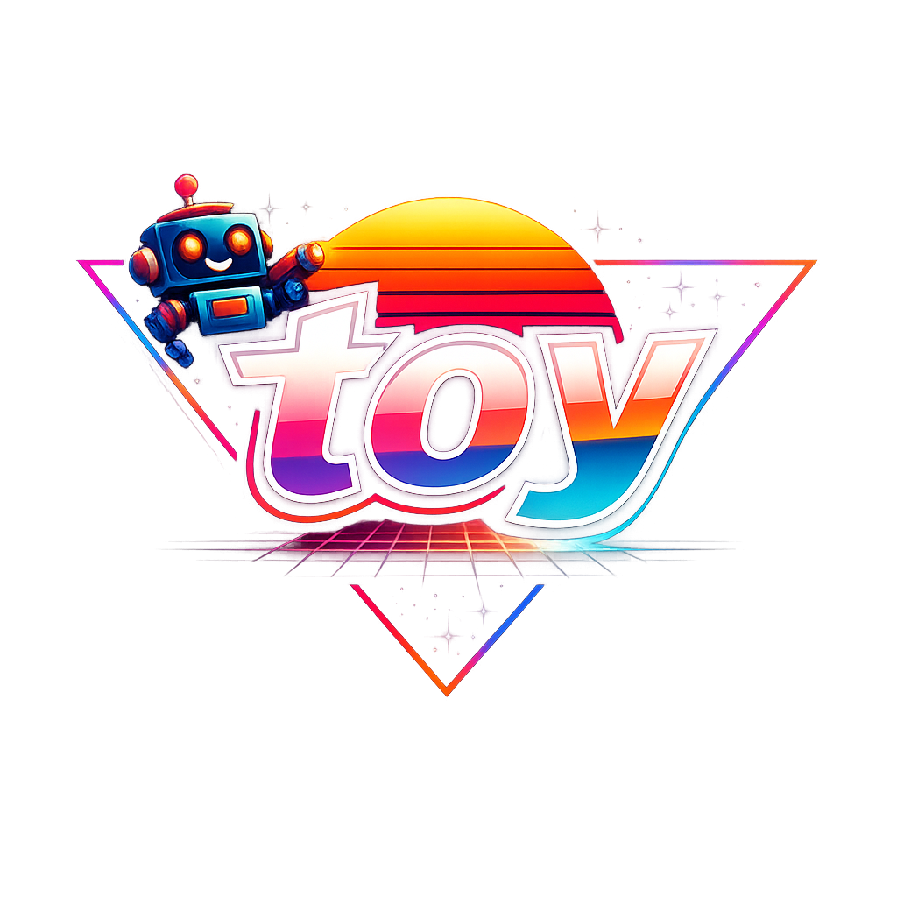

# toy

<p align="center">
  
</p>

A small transformer language model in Ruby. AOT-compiled to a native
binary by [Spinel](https://github.com/matz/spinel) (matz's Ruby AOT
compiler). Runs real HuggingFace models — GPT-2 and SmolLM2-135M —
at output-identical fidelity to PyTorch.

The goal is to be **readable**: the whole forward pass fits on one
screen, every shape is annotated inline, the building blocks are
named after the math.

So code can look like:

```ruby
  # One transformer block: pre-LN → MHA → residual → pre-LN → FFN → residual.
  # x is mutated in place via add!; returned for chaining.
  def transformer_block(x, block)
    h_norm  = layer_norm(x, block.ln1_gamma, block.ln1_beta)
    attn    = self_attention(h_norm, block)
    x.add!(attn)

    h_norm2 = layer_norm(x, block.ln2_gamma, block.ln2_beta)
    ff      = feed_forward(h_norm2, block)
    x.add!(ff)

    x
  end

  # embed -> N blocks -> final LN -> tied unembed -> logits[T, vocab]
  def forward(token_ids, start_pos)
    x = embed(token_ids, start_pos)

    li = 0
    while li < @n_layers
      x = transformer_block(x, @gpt2_blocks[li])
      li += 1
    end

    x_final = layer_norm(x, @ln_f_gamma, @ln_f_beta)
    # logits = x_final · token_embedᵀ  (tied output embedding)
    x_final.matmul_t(@token_embed)
  end
```

And it can even actually output a model card like:

```ruby
═══════════════════════════════════════════════════════════════════════════
 Toy::GPT2 — algorithm cards
═══════════════════════════════════════════════════════════════════════════
loading data/distilgpt2-f32.gguf (100 tensors)

Algorithm: Toy::GPT2.forward(x, p_start)      [HF GPT-2 family]
  Input:    x ∈ {1..V}^T   (token IDs)
            p_start ∈ ℕ   (absolute position of x[0])
  Output:   P ∈ R^{T×V}   (logits)
  Hyper:    V=50257 D=768 H=12 D_f=3072 N=6 ctx=1024
  Param:    W_e ∈ R^{V×D}   (token embeddings)
            W_p ∈ R^{ctx×D}   (learned absolute positions)
            θ_block_ℓ ∈ (ℓ=1..N)   (per-block; see GPT2Block)
            γ_f, β_f ∈ R^D   (final LayerNorm)
            (total 81.91M, embeddings tied: logits = e · W_e^⊤)
   1: e ← W_e[x] + W_p[p_start : p_start+T]                           e ∈ R^{T×D}
   2: for ℓ ← 1, …, N do
   3:    e ← e + Attn(LN(e; γ_ℓ^1, β_ℓ^1, ε); θ_ℓ^attn)               e ∈ R^{T×D}
   4:    e ← e + FFN (LN(e; γ_ℓ^2, β_ℓ^2, ε); θ_ℓ^ffn )               e ∈ R^{T×D}
   5: end for
   6: e ← LN(e; γ_f, β_f, ε)                                          e ∈ R^{T×D}
   7: P ← e · W_e^⊤                                                   P ∈ R^{T×V}
   8: return P


─── sub-algorithms ─────────────────────────────────────────────────────

Algorithm: GPT2Block.forward(x)
  Input:    x ∈ R^{T×D}
  Output:   x ∈ R^{T×D}
   1: x ← x + Attn(LN(x; γ_1, β_1, ε))                                ▷ residual after attention
   2: x ← x + FFN (LN(x; γ_2, β_2, ε))                                ▷ residual after FFN
   3: return x


LN(x; γ, β, ε) := (x − mean(x)) / √(var(x) + ε) ⊙ γ + β

Algorithm: CausalSelfAttention.forward(x)
  Input:    x ∈ R^{T×D}
  Output:   y ∈ R^{T×D}
  Hyper:    D=768 H=12 D_h=64
  Param:    W_Q^h, W_K^h, W_V^h ∈ R^{D×D_h}
            b_Q^h, b_K^h, b_V^h ∈ R^{D_h}
            W_O ∈ R^{D×D}
            b_O ∈ R^{D}
   1: for h ← 1, …, H do                                              ▷ per head
   2:    q^h ← x · W_Q^h + b_Q^h                                      q^h ∈ R^{T×D_h}
   3:    k^h ← x · W_K^h + b_K^h                                      k^h ∈ R^{T×D_h}
   4:    v^h ← x · W_V^h + b_V^h                                      v^h ∈ R^{T×D_h}
   5:    S^h ← q^h · (k^h)^⊤ / √D_h                                   S^h ∈ R^{T×T}
   6:    S^h ← CausalMask(S^h)                                        ▷ j>i ↦ −∞
   7:    A^h ← softmax_rows(S^h)                                      A^h ∈ R^{T×T}
   8:    o^h ← A^h · v^h                                              o^h ∈ R^{T×D_h}
   9: end for
  10: y ← concat(o^1, …, o^H) · W_O + b_O                             y ∈ R^{T×D}
  11: return y


Algorithm: FFN.forward(x)      [GPT-2-style MLP]
  Input:    x ∈ R^{T×D}
  Output:   y ∈ R^{T×D}
  Hyper:    D=768 D_f=3072 activation=gelu_new
  Param:    W_1 ∈ R^{D×D_f}
            b_1 ∈ R^{D_f}
            W_2 ∈ R^{D_f×D}
            b_2 ∈ R^{D}
   1: h ← gelu(x · W_1 + b_1)                                         h ∈ R^{T×D_f}
   2: y ← h · W_2 + b_2                                               y ∈ R^{T×D}
   3: return y
```

## Quickstart
We are keeping for the time-being a small amount of tools in Python for data preparation. Otherwise its all compiled Ruby.

```sh
make setup-ggml                                # ~30 s
./prep/convert_smollm2_to_gguf.py              # ~30 s; writes data/smollm2-135m-f32.gguf
./prep/smollm2_tokens.py encode "Once upon a time"

make smollm2_kv && ./demos/smollm2_kv          # ~77 tok/s on M2 Air
./prep/smollm2_tokens.py decode
# → "Once upon a time, there was a little girl named Lily..."
```

Requires Ruby, Spinel checked out at `~/sites/spinel`, and a C
compiler. `uv` installs itself for the Python converter; or
`pip install uv` first.

## What's in the box

| Path | What |
|---|---|
| [`lib/toy.rb`](lib/toy.rb)              | Building blocks: `Mat`, `LayerNorm`, `RMSNorm`, `Linear`, `Embedding`, `CausalSelfAttention`, `GQAttention`, `FFN`, `SwiGLU`, `RoPE` |
| [`lib/toy_gpt2.rb`](lib/toy_gpt2.rb)    | `Toy::GPT2` — full HF GPT-2 in ~80 lines |
| [`lib/toy_smollm2.rb`](lib/toy_smollm2.rb) | `Toy::SmolLM2` — Llama family (SmolLM2 / TinyLlama shape) |
| [`lib/toy_smollm2_ffi_kv*.rb`](lib/)    | KV-cache FFI mirror (CPU + CUDA) — the perf path |
| [`lib/toy_trainer.rb`](lib/toy_trainer.rb) | `Toy::Trainer` — training-loop wrapper |
| [`sig/toy.rbs`](sig/toy.rbs)            | RBS type signatures (validates via `rbs validate`) |
| [`demos/`](demos/)                      | End-to-end Ruby drivers — see [`demos/README.md`](demos/README.md) |
| [`docs/`](docs/)                        | Long-form notes: bench numbers, Spinel issue drafts, design scout |

## Highlights

- **Introspection**: every `Mat` knows its shape (`x.shape` → `"[5, 768]"`),
  every layer has a `summary` + `param_count`, every model has
  `describe` and `algorithm_card`. The latter emits Phuong–Hutter style
  pseudocode (arXiv:2207.09238) with shape annotations on every line
  — what the code actually does, written like the paper.
- **Round-trip**: [`prep/card_to_code.rb`](prep/card_to_code.rb) parses
  an algorithm card back to the Ruby that constructs the model.
- **Throughput**: SmolLM2-135M reaches **77 tok/s on M2 Air CPU** and
  **89 tok/s on NVIDIA GB10 CUDA** through the FFI KV-cache path.
  Full numbers in [`docs/bench-gx10-2026-05-16.md`](docs/bench-gx10-2026-05-16.md).
- **Real models, real outputs**: SmolLM2-135M on "Once upon a time"
  produces "Once upon a time, there was a little girl named Lily…" —
  the actual canonical SmolLM2 continuation.

## Reading the rest

- [`docs/HF_GPT2.md`](HF_GPT2.md) — the long story of getting GPT-2
  to run identically to PyTorch
- [`docs/bench-gx10-2026-05-16.md`](docs/bench-gx10-2026-05-16.md) — perf
  numbers across the paths
- [`docs/scout-small-models.md`](docs/scout-small-models.md) — design
  notes for what to support next
- [`docs/tinyllama-known-issue.md`](docs/tinyllama-known-issue.md) —
  the f32-precision issue when running TinyLlama via FFI
- [`docs/spinel-issues/`](docs/spinel-issues/) — Spinel bugs filed
  during this project (all closed at time of writing)
- [`tep_demo/README.md`](tep_demo/README.md) — OpenAI-compatible HTTP
  API via Tep+Spinel

A toy you can read top-to-bottom that happens to run real models.
